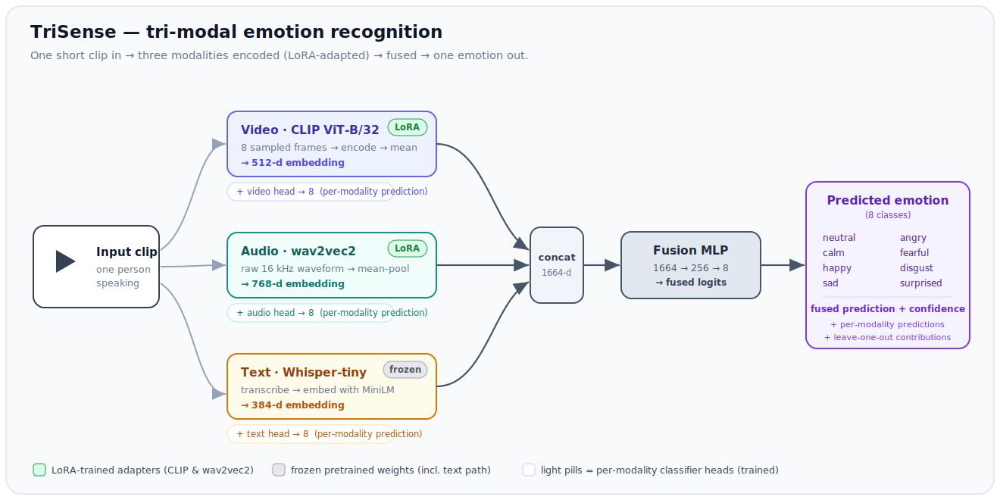

# TriSense: tri-modal emotion recognition with LoRA fine-tuning

TriSense looks at a short clip of one person speaking and predicts their **emotion** by
combining three modalities at once:

| Modality | What it reads | Encoder |
|----------|--------------|---------|
| 🎞️ **Video** | the face, from a few sampled frames | CLIP image tower (`openai/clip-vit-base-patch32`) |
| 🔊 **Audio** | the tone of voice, from the raw waveform | `facebook/wav2vec2-base` |
| 📝 **Text** | the spoken words | Whisper-tiny transcribes, then `all-MiniLM-L6-v2` embeds |

The three embeddings are fused by a small MLP into one prediction over 8 emotions
(*neutral, calm, happy, sad, angry, fearful, disgust, surprised*).

**What this repo is.** A portfolio project that demonstrates **backend, frontend, MLOps,
and multimodal deep-learning** skills end to end. It runs **fully in Docker with one
command on a CPU laptop**, because the repo ships a trained checkpoint, so it works out of
the box with no setup.

**Why build it this way.** Three reasons drive the design:

1. **Why tri-modal?** Emotion shows up in the face, the voice, *and* the words. Using all
   three is more robust than any single signal, and it lets the app *explain itself* by
   showing how much each modality contributed.
2. **Why LoRA?** Fully retraining CLIP and wav2vec2 is expensive. LoRA fine-tunes a tiny
   set of added weights instead, which is cheap, fast, and produces a checkpoint of only a
   few MB. It is the core method here (details [below](#the-method-lora-is-the-centerpiece)).
3. **Why one-command Docker?** A reviewer should see a working app in one step, with no
   GPU, no API keys, and no paid services.

> **The core method is LoRA fine-tuning.** The big CLIP and wav2vec2 encoders stay frozen;
> TriSense trains only small low-rank adapters injected into their attention layers,
> together with the classifier heads. Cheap to train, tiny to ship.

<p align="center">
  
</p>

---

## Quick start (the only command you need)

```bash
docker compose up --build
```

Then open:

- **http://localhost:8000** for the TriSense app (upload a clip, see the explained prediction).
- **http://localhost:5000** for the MLflow UI (training runs, metrics, confusion matrix).

No GPU, no API keys, no internet at run time. The pretrained weights and the trained
checkpoint are baked into the image; the app loads the committed checkpoint and **never
trains at run time**.

> RAVDESS clips are short scripted sentences. To try it yourself, record a 1 to 5 second
> clip of a face speaking (mp4/mov/avi/mkv/webm, up to 50 MB) and upload it. You can also
> just browse the built-in **Results Gallery**, which shows held-out test clips with no
> upload needed.

---

## What you get in the UI

- **Fused prediction with confidence** for the uploaded clip.
- **Per-modality predictions**, showing what video, audio, and text each predict on their own.
- **Modality contribution chart**, a *leave-one-modality-out* bar chart. TriSense drops each
  modality in turn and measures how far the fused confidence falls. This is the
  explainability centerpiece, and it is intuitive: a tall bar means that modality mattered.
- **Transcript** from Whisper, plus the **sampled frames** the model actually looked at.
- **Results Gallery**, a handful of committed held-out clips, each with its true label, the
  fused and per-modality predictions, and the contribution chart.
- **Model card**, reporting held-out **accuracy**, **macro-F1**, the **confusion matrix**,
  and a link to the MLflow runs.

---

## The method: LoRA is the centerpiece

LoRA (Low-Rank Adaptation) keeps a pretrained encoder frozen and learns a small pair of
low-rank matrices added to chosen weight matrices. You train roughly 1% of the parameters,
keep most of the benefit of fine-tuning, and end up with a tiny checkpoint.

In TriSense:

- **Frozen base encoders:** all of CLIP's and wav2vec2's pretrained weights.
- **LoRA adapters (trained):** injected into the attention projections
  (`q_proj`, `k_proj`, `v_proj`, `out_proj`) of **both** CLIP and wav2vec2.
- **Heads (trained):** a per-modality linear classifier for video, audio, and text, plus
  the fusion MLP.
- **Text path stays fully frozen:** Whisper transcribes and MiniLM embeds; only the small
  text head learns. (RAVDESS uses two scripted sentences, so the text branch mainly proves
  the pipeline rather than carrying strong emotional signal. See [Honest caveats](#honest-caveats).)

Everything is configurable: which encoders get LoRA, LoRA rank and alpha, learning rate,
batch size, epochs, mixed precision, and the `cuda`/`cpu` device flag.

**Two training modes:**

| | Quick CPU path | Real GPU run **(committed)** |
|---|---|---|
| Encoders | frozen (LoRA off) | **LoRA on CLIP and wav2vec2** |
| Trains | the 4 heads only | LoRA adapters plus the 4 heads |
| Why | finishes in minutes so the app runs end to end with no GPU | the real fine-tuning run that ships in this repo |
| Command | `make train` | `make train-gpu` |

**The committed checkpoint is the real LoRA run** (rank 16, alpha 32, on both encoders,
15 epochs, mixed precision on an RTX 2080 Ti). On a balanced 20-actor RAVDESS subset
(336 train, 72 val, 72 test) it reaches:

| Metric | Value |
|---|---|
| Fused test accuracy | **84.7%** (random baseline 12.5%) |
| Macro-F1 | **0.85** |
| Per-modality accuracy | video 77.8% · audio 52.8% · text 6.9% |
| Fusion vs. best single modality | 84.7% ≥ 77.8% ✓ |

LoRA clearly helps. Versus a frozen-encoder baseline, the audio head climbs from about 35%
to about 53% (the wav2vec2 adapters), and fused accuracy rises from about 79% to about 85%.
The reproducible quick CPU path (`make train`) is still there for a no-GPU end-to-end run.

---

## Architecture

The [diagram above](#trisense-tri-modal-emotion-recognition-with-lora-fine-tuning) shows the
full data flow: a clip is encoded by three modality branches, their embeddings are
concatenated and fused into one prediction, and every modality also keeps its own head for
the per-modality predictions and the leave-one-out explainability. Code layout:

```
backend/app/
  encoders/      video.py (CLIP), audio.py (wav2vec2), text.py (Whisper+MiniLM)
  model/         fusion.py (TriSenseModel), lora.py (adapters), checkpoint.py (small ckpt I/O)
  features/      pipeline.py (clip to frames, audio, transcript, embeddings)
  service/       inference.py (prediction plus leave-one-out explainability)
  api/           routes.py (analyze, health, model-card, gallery)
  main.py        FastAPI app; serves /api and the built SPA at /
training/        download_data.py, prefetch_models.py, train.py, evaluate.py, make_gallery.py
frontend/        React + Vite + TypeScript + Plotly single page
```

---

## API

| Method and path | Purpose |
|---|---|
| `POST /api/analyze` | Upload a clip and get the full explainable JSON (fused and per-modality predictions, leave-one-out contributions, transcript, frames). |
| `GET /api/health` | Liveness, plus whether the model is loaded. |
| `GET /api/model-card` | Held-out accuracy, macro-F1, confusion matrix. |
| `GET /api/gallery` | Pre-computed held-out results gallery. |

Interactive docs at `http://localhost:8000/docs`.

---

## How to get the data and train the quick checkpoint

The dataset is not committed (only the manifest and the small checkpoint are). To fetch the
data and build a quick checkpoint yourself, run two make targets:

```bash
make data       # downloads a RAVDESS subset and builds data/subset/manifest.csv
make train      # caches features once, trains the heads, writes the checkpoint,
                # the model card, the confusion matrix, and the results gallery,
                # logging everything to MLflow (./mlruns)
```

`make data` is configurable. For example, `make data ACTORS=24 PER_CLASS=80` downloads more
actors and builds a larger balanced subset. Each option maps to a flag on
`training/download_data.py` (`--actors`, `--per-class`, `--data-dir`), so the same script
builds both the small subset and the full one.

### Dataset: RAVDESS

[RAVDESS](https://zenodo.org/records/1188976) is free on Zenodo. TriSense uses the speech,
audio-visual subset: 8 emotions, one actor per clip, with both a face and a voice.
`download_data.py` keeps only the audio-visual speech files and builds a small **balanced**
subset (40 to 80 clips per emotion, configurable) with a stratified train/val/test split.

---

## Training the real model (on a GPU)

The real LoRA fine-tuning runs **locally, outside Docker**, on your GPU. Reference hardware
for the committed run: an **NVIDIA RTX 2080 Ti (11 GB)**.

```bash
# 1) Environment with the CUDA build of PyTorch (instead of the CPU build):
uv venv .venv --python 3.12 && . .venv/bin/activate
uv pip install -r training/requirements.txt --extra-index-url https://download.pytorch.org/whl/cu121

# 2) A larger RAVDESS subset (more actors, more clips per emotion):
python training/download_data.py --actors 24 --per-class 80

# 3) The real run: LoRA on both encoders, GPU, mixed precision:
make train-gpu
# == python training/train.py --device cuda --amp \
#       --lora-video --lora-audio --lora-rank 16 --lora-alpha 32 \
#       --epochs 15 --batch-size 24 --lr 2e-4 --run-name gpu-lora-both
```

**Recommended starting settings (2080 Ti, 11 GB).** These are starting points, not gospel:

| Setting | Value |
|---|---|
| LoRA | on CLIP **and** wav2vec2 |
| LoRA rank / alpha | 16 / 32 |
| Mixed precision | on (`--amp`) |
| Batch size | 16 to 32 (24 fits in 11 GB) |
| Epochs | 8 to 15 |
| Learning rate | about 2e-4 |

**What good looks like:**

- Fused **accuracy clearly above the 12.5% random baseline** for 8 classes.
- **Fused accuracy at or above the best single modality.** Fusion should help, not hurt.

**Troubleshooting:**

- *Out of memory:* lower `--batch-size` (try 16, then 8) and keep `--amp` on.
- *Underfitting or low accuracy:* train more epochs, raise `--lr`, or raise `--lora-rank`
  (for example 16 to 32) so the adapters have more capacity.

**After the run:**

```bash
mlflow ui            # or keep the docker mlflow service up; inspect metrics
# happy with it? the new checkpoint is already at checkpoints/trisense.pt
python training/evaluate.py --device cuda   # refresh model card + confusion matrix
python training/make_gallery.py --device cuda
git add checkpoints/trisense.pt artifacts/ && git commit -m "Update checkpoint from GPU run"
```

The app then serves the new checkpoint automatically.

---

## MLOps

[MLflow](https://mlflow.org/) (open source) tracks every run: parameters (LoRA settings,
learning rate, batch size, epochs), metrics (accuracy, macro-F1, loss curves, per-modality
accuracy), the confusion-matrix artifact, the model card, and the saved checkpoint. Training
is a single reproducible command (`make train` or `make train-gpu`) that logs to `./mlruns`.
The **MLflow UI runs as a Docker service** on port 5000 and reads the `./mlruns` you produce
locally, so runs appear there after you train.

---

## Honest caveats

- **Text branch.** RAVDESS has only two scripted sentences ("Kids are talking by the door"
  and "Dogs are sitting by the door"), so the spoken *words* barely correlate with emotion.
  The text path is real and end to end (Whisper, then MiniLM, then a head), but it mainly
  proves the tri-modal pipeline rather than adding strong signal. The leave-one-out chart
  shows this honestly: text usually contributes little.
- **The committed checkpoint is the real LoRA run** (GPU, rank 16 on both encoders, 84.7%
  test accuracy; see [the table above](#the-method-lora-is-the-centerpiece)). A
  frozen-encoder CPU checkpoint (`make train`) is also reproducible in minutes for a no-GPU
  end-to-end run; it clears the baseline but is weaker.
- **Scope.** One person per clip, a roughly frontal face, and a short clip. That is the
  RAVDESS setting.

---

## Tech stack

FastAPI · PyTorch · Hugging Face Transformers · PEFT (LoRA) · sentence-transformers ·
OpenCV · librosa · React · Vite · TypeScript · Plotly · MLflow · Docker. Everything is free
and open source.

## License

MIT. See [LICENSE](LICENSE).
